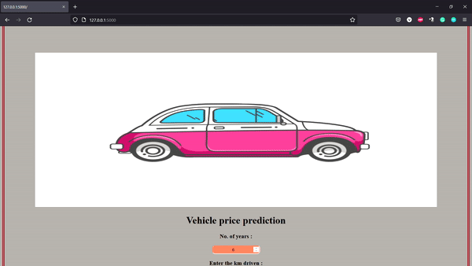

# Car Price prediction

## Table of Content
  * [Demo](#demo)
  * [Synopsis](#synopsis)
  * [Appendix](#appendix)
  * [Links](#links)
  * [Directory Tree](#directory_tree)
  * [Color Reference](#color_reference)
  * [Features](#features)
  * [Run Locally](#run_locally)
  * [License](#license)
  * [Technology Used](#technology_used)

## Demo



## Synopsis

Car price prediction program is executed with the help of car dekhko dataset, where based on the given features, such as the year the car bought and how much kilometers driven and the fuel type of the car, the seller type based on which the seller sells the car, either the seller may be individual or a dealer, and the owner of a car indicates a first owner, a second owner or a third and more owner which alters the selling price of the car, and the type by which car differs is the transmission of the car, which is either manual or automatic driven cars. This app is very much useful for the people who want to know how much the amount the car can be sold or bought.

So based on the given data, 
#### Independent variable (X) : Name, year, km_driven, fuel, seller_type, transmission, owner
#### Dependent variable (Y) : selling_price

Based on the given data we can identify this as a regression problem, so we can use various machine learning problems to solve this problem which are as follows:
* Linear regression
* Lasso regression
* Ridge regression
* Decision tree regressor
* Random forest regressor

Machine learning model  : Random forest regressor (sklearn)

Data preprocessing      : Pandas 

Data visualization      : Matplotlib, Seaborn

Web framework           : Flask

Model deployment        : Heroku platform


## Appendix

The requirement for developing this model is present in the [requirements.txt](https://github.com/Vedakeerthi/CAR_PRICE_PREDICTION/blob/main/requirements.txt) file.

The development of the model is present in the [main.ipynb](https://github.com/Vedakeerthi/CAR_PRICE_PREDICTION/blob/main/main.ipynb) file.

The pickle file of the model for deployment is present in [car price prediction](https://github.com/Vedakeerthi/CAR_PRICE_PREDICTION/blob/main/Car_prediction.zip) folder.

The flask framework for the web app development is made in the [app.py](https://github.com/Vedakeerthi/CAR_PRICE_PREDICTION/blob/main/app.py) file.

The templates for the framework is done in html and css and the file is located in the [templates](https://github.com/Vedakeerthi/CAR_PRICE_PREDICTION/tree/main/templates) folder.

## Links

 - #### Dataset link : https://www.kaggle.com/datasets/mohamedsamir3/car-price-details
 - #### Github link  : https://github.com/Vedakeerthi/CAR_PRICE_PREDICTION
 
## Directory Tree <a name='directory_tree'></a>

```
├── template
│   ├── home.html
├── Procfile
├── README.md
├── CAR DETAILS FROM CAR DEKHO.csv
├── model-gif.gif
├── app.py
├── main.ipynb
|── Car_prediciton.pkl
├── requirements.txt
```
 
## Color Reference <a name='color_reference'></a>

| Color                  | Hex                                                                |
| -----------------      | ------------------------------------------------------------------ |
| Body of the web page   |  #A09B97 |
| Border of the web page |  #A40000 |


## Features

- Live prediction analysis.
- Fullscreen mode supports in mobile, pc.
- Cross platform can be used on multiple operating system.


## Run Locally <a name='run_locally'></a>

Clone the project

```bash
  git clone https://github.com/Vedakeerthi/CAR_PRICE_PREDICTION.git
```

Install dependencies

```bash
  pip install -r requirements.txt
```

Start the server

```bash
  python app.py
```

Run the app on server by the local link provided


## License

[](https://github.com/Vedakeerthi/CAR_PRICE_PREDICTION/blob/main/LICENSE)

## Technology Used <a name='technology_used'></a>

<a href="https://www.python.org" target="_blank" rel="noreferrer">  </a> &nbsp;
<a href="https://scikit-learn.org/" target="_blank" rel="noreferrer">  </a> &nbsp;
<a href='https://flask.palletsprojects.com/en/2.1.x/' target="_blank" rel="noreferrer"> </a> &nbsp;
<a href='https://gunicorn.org/' targe="_blank" rel="noreferrer"></a> &nbsp;
